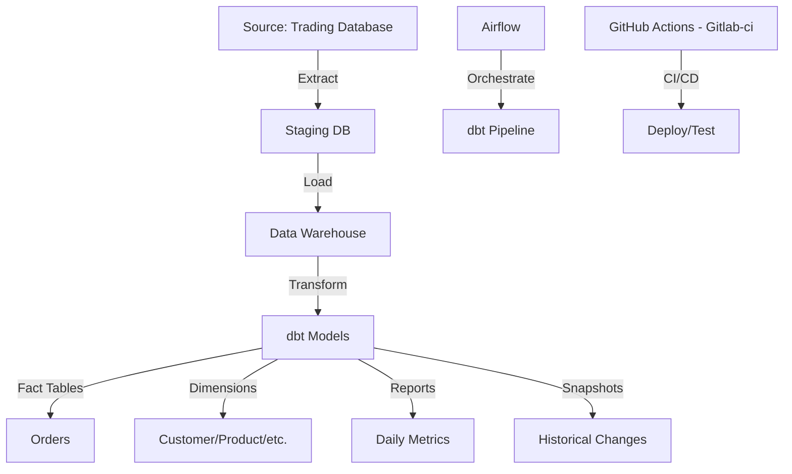

# Financial Trading Data Pipeline

## Overview
A production-grade ELT pipeline that processes financial trading data using dbt, orchestrated by Apache Airflow, and automated through Gitlab-ci/GitHub Actions. The pipeline transforms raw trading data into a dimensional model with fact tables, dimensions, and analytical reports, including SCD Type 2 tracking for key metrics.

## Architecture


## Prerequisites
- Python 3.8+
- dbt-core 1.5+
- SQL Server (Target Database)
- Git

## Project Structure
```
fin_trade/
├── .github/
│   └── workflows/           # GitHub Actions workflows
├── .gitlab/
│   └── ci/                  # Gitlab-ci 
├── dags/                    # Airflow DAGs
│   └── utils/              # DAG utility functions and helpers
├── fin_trade/              # dbt project
│   ├── models/
│   │   ├── dim/           # Dimension models
│   │   ├── fct/           # Fact models
│   │   └── reports/       # Reporting models
│   ├── snapshots/         # SCD Type 2 definitions
│   ├── tests/             # Custom dbt tests
│   ├── docs/              # Project documentation
│   └── scripts/           # Utility scripts
```

## Setup and Installation

### 1. Clone Repository
```bash
git clone https://github.com/ihamidkev3/fin_trade.git
cd fin_trade
```

### 2. Environment Setup
```bash
python -m venv venv
source venv/bin/activate  # Linux/Mac
.\venv\Scripts\activate   # Windows
pip install -r requirements.txt
```

### 3. Configuration
1. Copy example environment files:
```bash
cp .env.example .env
```

2. Update environment variables:
```env
SQL_SERVER_DRIVER=ODBC Driver 17 for SQL Server
SQL_SERVER_IP=your_server_ip
SQL_SERVER_PORT=your_port
DBT_USER=your_username
DBT_PASSWORD=your_password
TARGET_SCHEMA=your_database
TARGET_DB_SCHEMA=your_schema
SQL_SERVER_ENCRYPT=false
SQL_SERVER_TRUST_CERT=true
SQL_COMMAND_TIMEOUT=300
SQL_RETRIES=3
```

3. Configure dbt profile:
```yaml
# ~/.dbt/profiles.yml
fin_trade:
  outputs:
    default:
      type: sqlserver
      driver: "{{ env_var('SQL_SERVER_DRIVER') }}"
      server: "{{ env_var('SQL_SERVER_IP') }}"
      port: "{{ env_var('SQL_SERVER_PORT') }}"
      user: "{{ env_var('DBT_USER') }}"
      password: "{{ env_var('DBT_PASSWORD') }}"
      database: "{{ env_var('TARGET_SCHEMA') }}"
      schema: "{{ env_var('TARGET_DB_SCHEMA') }}"
      encrypt: "{{ env_var('SQL_SERVER_ENCRYPT') | lower }}"
      trustServerCertificate: "{{ env_var('SQL_SERVER_TRUST_CERT') | lower }}"
      timeout: "{{ env_var('SQL_COMMAND_TIMEOUT') }}"
      retries: "{{ env_var('SQL_RETRIES') }}"
  target: default
```

## Pipeline Components

### 1. dbt Models
- **Dimensions**: Customer profiles, products, order types
- **Facts**: Trading orders and transactions
- **Reports**: Daily activity metrics and aggregations
- **Snapshots**: Track changes in account stages and activity profiles

### 2. Airflow DAG
The pipeline is orchestrated through `dbt_dag.py`:
```python
setup_group >> run_el >> dbt_deps >> dbt_build >> dbt_docs_generate 
```

### 3. CI/CD Pipeline
GitHub Actions workflow automates:
- Code linting and testing
- dbt documentation generation
- Infrastructure validation
- Deployment to staging/production

## Development Workflow

### 1. Local Development
```bash
# Install dependencies
dbt deps

# Run models
dbt run

# Test models
dbt test

# Generate docs
dbt docs generate

```

### 2. Creating New Models
1. Create model SQL file
2. Add tests in schema.yml
3. Update documentation
4. Run locally and verify
5. Create pull request

### 3. Deployment Process
1. Push changes to feature branch
2. GitHub Actions runs tests
3. Create pull request
4. Review and approve
5. Merge triggers deployment

## Testing

### 1. dbt Tests
```bash
# Run all tests
dbt test

# Test specific models
dbt test --models dim_*

# Run data quality tests
dbt test --tags data_quality
```

### 2. Custom Tests
within YAML files:
- Data quality checks
- Business logic validation
- Referential integrity

## Monitoring

### 1. Airflow
- DAG runs status
- Task duration metrics
- Error logging

### 2. dbt
- Model run history
- Test results
- Documentation

## Documentation
- [Project Overview](fin_trade_dbt/docs/project_overview.md)

## Contributing
1. Fork the repository
2. Create feature branch
3. Commit changes
4. Create pull request
5. Ensure CI passes

## License
MIT License - see LICENSE file for details

## Contact
For questions or support, please contact [h.hajimirza3@gmail.com] 